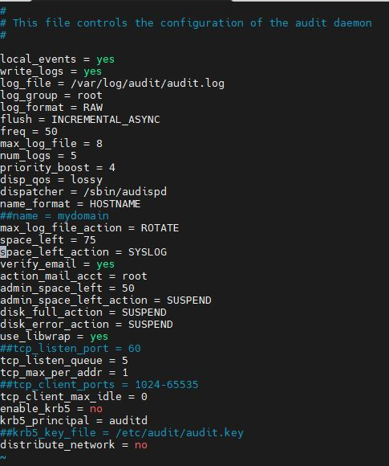

# Сбор и анализ логов. Настраиваем центральный сервер для сбора логов

## Инструкция по выполнению домашнего задания:

### Цель домашнего задания

Научится проектировать централизованный сбор логов. Рассмотреть особенности разных платформ для сбора логов.

### Описание домашнего задания
1. В Vagrant разворачиваем 2 виртуальные машины web и log
2. на web настраиваем nginx
3. на log настраиваем центральный лог сервер на любой системе на выбор
journald;
rsyslog;
4. настраиваем аудит, следящий за изменением конфигов nginx 

Все критичные логи с web должны собираться и локально и удаленно.
Все логи с nginx должны уходить на удаленный сервер (локально только критичные).
Логи аудита должны также уходить на удаленную систему.


## 1. Создаём виртуальные машины

Создаём каталог, в котором будут храниться настройки виртуальной машины. В каталоге создаём файл с именем Vagrantfile
```
vagrant up
```
Заходим на web-сервер: 
```
vagrant ssh web
```
Укажем часовой пояс (Московское время):
```
cp /usr/share/zoneinfo/Europe/Moscow /etc/localtime
```


Перезупустим службу NTP Chrony:
```
systemctl restart chronyd
```
Проверим, что служба работает корректно:
```
systemctl status chronyd
```


## 2. Установка nginx на виртуальной машине web

Установим nginx: 
```
yum install -y nginx
```
Проверим, что nginx работает корректно:


## 3. Настройка центрального сервера сбора логов

Откроем ещё одно окно терминала и подключимся по ssh к ВМ log: 
```
vagrant ssh log
```
rsyslog должен быть установлен по умолчанию в нашёй ОС, проверим это:
```
yum list rsyslog
```


Все настройки Rsyslog хранятся в файле /etc/rsyslog.conf 
Для того, чтобы наш сервер мог принимать логи, нам необходимо внести следующие изменения в файл: 
Открываем порт 514 (TCP и UDP):


В конец файла /etc/rsyslog.conf добавляем правила приёма сообщений от хостов:


Данные параметры будут отправлять в папку /var/log/rsyslog логи, которые будут приходить от других серверов. Например, Access-логи nginx от сервера web, будут идти в файл /var/log/rsyslog/web/nginx_access.log
Далее сохраняем файл и перезапускаем службу rsyslog:

```
systemctl restart rsyslog
```
Заходим на web сервер:
```
vagrant ssh web
```
Проверим версию nginx:
```
rpm -qa | grep nginx
```


Версия nginx должна быть 1.7 или выше. В нашем примере используется версия nginx 1.20. 
Находим в файле /etc/nginx/nginx.conf раздел с логами и приводим их к следующему виду:


Для Access-логов указыаем удаленный сервер и уровень логов, которые нужно отправлять. Для error_log добавляем удаленный сервер. Если требуется чтобы логи хранились локально и отправлялись на удаленный сервер, требуется указать 2 строки. 	
Tag нужен для того, чтобы логи записывались в разные файлы.
По умолчанию, error-логи отправляют логи, которые имеют severity: error, crit, alert и emerg. Если трубуется хранили или пересылать логи с другим severity, то это также можно указать в настройках nginx. 
Далее проверяем, что конфигурация nginx указана правильно:
```
nginx -t
```


Далее перезапустим nginx:
```
systemctl restart nginx
```

Чтобы проверить, что логи ошибок также улетают на удаленный сервер, можно переименовать папку /usr/share/nginx/html/
```
mv /usr/share/nginx/html/ /usr/share/nginx/html1/
```
Попробуем несколько раз зайти по адресу 
```
curl 192.168.50.10
```
Далее заходим на log-сервер и смотрим информацию об nginx:
```
cat /var/log/rsyslog/web/nginx_access.log 
```
```
cat /var/log/rsyslog/web/nginx_error.log 
```


## 4. Настройка аудита, контролирующего изменения конфигурации nginx

За аудит отвечает утилита auditd, в RHEL-based системах обычно он уже предустановлен.

Настроим аудит изменения конфигурации nginx:
Добавим правило, которое будет отслеживать изменения в конфигруации nginx. Для этого в конец файла /etc/audit/rules.d/audit.rules добавим следующие строки:


Перезапускаем службу auditd: 
```
service auditd restart
```
После данных изменений у нас начнут локально записываться логи аудита. Чтобы проверить, что логи аудита начали записываться локально, нужно внести изменения в файл /etc/nginx/nginx.conf или поменять его атрибут, потом посмотреть информацию об изменениях:
```
grep nginx_conf /var/log/audit/audit.log
```


Далее настроим пересылку логов на удаленный сервер. Auditd по умолчанию не умеет пересылать логи, для пересылки на web-сервере потребуется установить пакет audispd-plugins: 

```
yum -y install audispd-plugins
```


Найдем и поменяем следующие строки в файле /etc/audit/auditd.conf: 


В файле /etc/audisp/audisp-remote.conf требуется указать адрес сервера и порт, на который будут отправляться логи:


Далее перезапускаем службу auditd: 
```
service auditd restart
```
На этом настройка web-сервера завершена. Далее настроим Log-сервер.
Отроем порт TCP 60, для этого уберем значки комментария в файле /etc/audit/auditd.conf:



Перезапустим службу auditd: 
```
service auditd restart
```

На этом настройка пересылки логов аудита закончена. Можем попробовать поменять атрибут у файла /etc/nginx/nginx.conf и проверить на log-сервере, что пришла информация об изменении атрибута:
```
ls -l /etc/nginx/nginx.conf
chmod +x /etc/nginx/nginx.conf
ls -l /etc/nginx/nginx.conf
```
```
grep web /var/log/audit/audit.log
```


